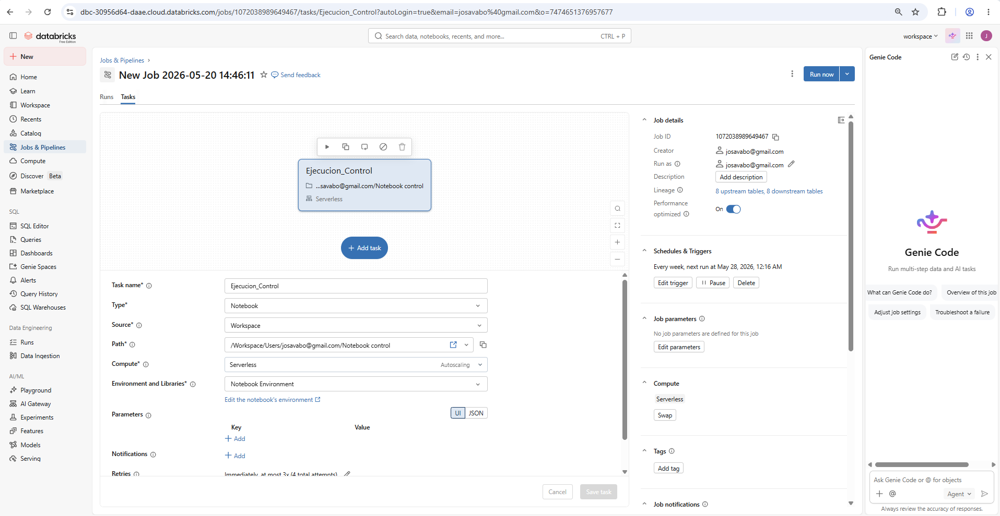

# proyecto-iam-medallion
Pipeline de auditoría de identidades y accesos (IAM) utilizando Arquitectura Medallion en Databricks, automatizado con Jobs y consultado mediante Databricks Genie.

# Auditoría Continua de Identidades y Accesos (IAM) mediante Arquitectura Medallion

## Información del Proyecto
* **Institución:** UNAULA
* **Materia:** Big Data
* **Docente:** Yeis
* **Integrantes:**
  * Daniel Gonzalez
  * Jose Santiago Valencia
  * Sebastian Castrillon

---

## Descripción del Proyecto
Este proyecto implementa un pipeline de Big Data optimizado para la gestión y auditoría automatizada de Identidades y Accesos (IAM - Identity and Access Management). Utilizando el entorno corporativo de **Databricks** y el motor de procesamiento distribuido **Apache Spark**, el sistema es capaz de contrastar la "Realidad" de los privilegios asignados en aplicaciones críticas (**Jira y Appgate**) frente al "Deber Ser" corporativo dictado por una **Matriz de Modelamiento de Roles**.

Para simular un entorno empresarial real, el pipeline se ejecuta de forma automatizada mediante un **Scheduled Job cada 8 días**, lo que garantiza un monitoreo constante y la detección temprana de brechas de seguridad informáticas (como cuentas huérfanas o privilegios excesivos).

---

## Arquitectura del Dato: Modelo Medallion

El procesamiento de datos se diseñó bajo el patrón de arquitectura **Medallion (Bronze, Silver, Gold)** para garantizar la limpieza progresiva y el gobierno del dato:

```text
  [ Fuentes Crudas ] ──>  🥉 Capa Bronze  ──>  🥈 Capa Silver  ──>  🥇 Capa Gold
  (IdentityX, Plantas,     (Delta Tables        (Resolución de       (Motor de Auditoría
   Extractos de Apps)       Inmutables)          Identidades)         & KPIs de Control)

```
---

### 🥉 1. Capa Bronze (Ingesta y Persistencia)

En esta fase se realiza la carga inicial de las fuentes de datos en bruto. Para asegurar un entorno realista y seguro, se generaron datos sintéticos robustos, libres de tildes o caracteres especiales, y con usuarios de red únicos para evitar errores de cruce.

#### 📊 Fuentes de Datos Guardadas en Bronze:

| Nombre de la Tabla | Tipo de Fuente | Propósito en la Auditoría |
| :--- | :--- | :--- |
| `identityx` | Maestro de RRHH | La lista oficializada de la empresa con 2,000 empleados únicos, sus cargos y áreas. |
| `planta_1` (Konecta) | Archivo de Proveedor | Diccionario que sirve de puente para asociar los correos `@konecta.com` con su usuario de red real. |
| `planta_2` (Teleperformance) | Archivo de Proveedor | Diccionario que sirve de puente para asociar los correos `@teleperformance.com` con su usuario de red real. |
| `matriz_modelamiento` | Política de Seguridad | El manual de reglas que define qué rol técnico en Jira o Appgate está autorizado para cada cargo. |
| `gda_appgate_usuarios_grupos` | Extracto de Aplicación | Reporte real de accesos en Appgate, detallando los permisos activos por cada usuario. |
| `jira_usuarios_permisos` | Extracto de Aplicación | Reporte real de accesos en Jira. Usa el correo electrónico como identificador principal. |

> 💡 *Nota de diseño:* En los extractos de Jira y Appgate se inyectó a propósito un 10% de errores de acceso aleatorios para poner a prueba la efectividad de nuestro motor de auditoría.

---

### 🥈 2. Capa Silver (Limpieza e Integración)

El objetivo principal de la capa Silver es la **Resolución de Identidades**. Dado que Jira registra los accesos mediante correos electrónicos y Appgate lo hace mediante usuarios de red, era necesario unificar esta realidad fragmentada.

#### 🛠️ Proceso de Transformación:
* **Cruce de Correos Externos:** Mediante consultas en Spark SQL, se tomaron los correos de Jira de los proveedores (Konecta y Teleperformance) y se cruzaron con las Plantas BPO. Usando funciones lógicas (`COALESCE`), logramos descubrir el verdadero usuario de red que operaba detrás de cada correo.
* **Unificación de Accesos:** Se juntaron verticalmente las listas de Jira y Appgate en una sola estructura limpia.
* **Enriquecimiento del Dato:** Esta lista unificada se cruzó mediante un `LEFT JOIN` con la tabla `identityx`. De este modo, a cada acceso en el sistema se le asignó automáticamente su contexto real: Cédula, Nombre Completo, Cargo Oficial y Departamento del empleado.

* **Resultado Final Silver:** `proyecto_iam_silver.maestro_accesos` (Un inventario único de accesos enriquecido con datos de identidad).

---

### 🥇 3. Capa Gold (Motor de Cumplimiento y Negocio)

Esta es la capa final de valor donde se ejecuta el **Motor de Cumplimiento**. Aquí se toma el maestro de accesos de la capa Silver y se compara de forma estricta contra las reglas de la `matriz_modelamiento` mediante lógica condicional (`CASE WHEN`).

Cada acceso evaluado es clasificado automáticamente bajo uno de los siguientes estados:

* **🟢 Modelado Correcto:** El empleado tiene asignado exactamente el permiso técnico que su cargo autoriza en la matriz.
* **🔴 Anomalía (Acceso Incorrecto):** El cargo del empleado está regulado, pero se detectó que tiene un permiso activo en Jira o Appgate que no le corresponde (Dispara una alarma de seguridad).
* **⚠️ Cuenta Huérfana:** El usuario tiene una cuenta activa en la aplicación, pero ya no existe en el maestro de RRHH de la empresa (Alto riesgo; suele ocurrir con empleados despedidos a los que no se les desactivó el acceso).
* **⚪ No Modelado:** El usuario está activo en la empresa, pero su cargo todavía no ha sido incluido o regulado dentro de la matriz de gobierno.

* **Resultado Final Gold:** `proyecto_iam_gold.reporte_auditoria` (La base de conocimiento definitiva para los auditores).

---

### ⚙️ Automatización y Operación (Orchestration)

Para garantizar que este control de seguridad sea constante y no dependa de ejecuciones manuales, el proceso completo se automatizó utilizando un **Databricks Scheduled Job**:

* **Frecuencia de ejecución:** Cada 8 días.
* **Propósito operativo:** Volver a procesar de forma automática todas las fuentes para descubrir nuevas cuentas huérfanas o cambios de permisos no autorizados realizados durante la última semana.

---

### 📊 Visualización e Inteligencia Artificial (Databricks Genie)

Para facilitar la toma de decisiones sin necesidad de escribir código técnico, la tabla final de la capa Gold se conectó a **Databricks Genie**. Esta herramienta de IA permite a los oficiales de seguridad y jefes de área realizar auditorías en tiempo real usando **lenguaje natural**, respondiendo preguntas como:

* *¿Cuántas anomalías de accesos se registran actualmente en Jira?*
* *Muéstrame una lista de las cuentas huérfanas activas que pertenecen al proveedor Konecta.*
* *¿Cuál es el porcentaje de cumplimiento de gobierno de accesos en la compañía?*

---

## 📸 Evidencias de Implementación

### 1. Orquestación del Pipeline (Databricks Job)
*(Coloca aquí tu captura de pantalla)*
`
*Evidencia de la programación cíclica del pipeline para ejecutarse automáticamente cada 8 días.*

### 2. Interfaz de Lenguaje Natural (Databricks Genie)
*(Coloca aquí tu captura de pantalla)*
`
*Evidencia del espacio de Genie configurado sobre las tablas de la capa Gold para realizar consultas interactivas.*
